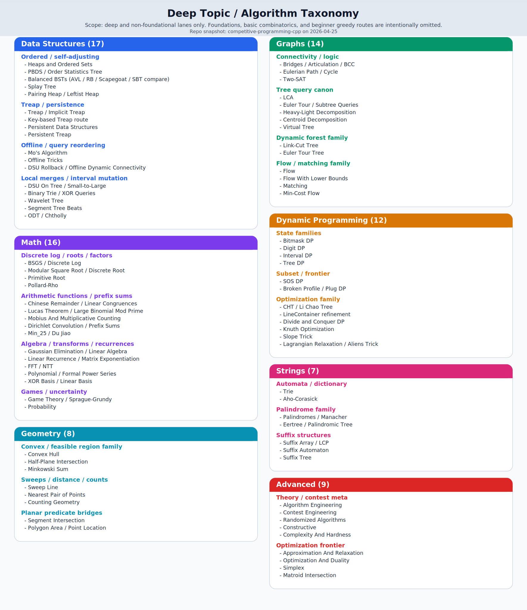

# Deep Topic Taxonomy

- Purpose: one-figure map of the repo's deep algorithm and data-structure surface
- Scope: advanced and non-foundational lanes only
- Last reviewed: 2026-04-25
- Companion pages: [Learning Areas](../topics/README.md), [Route Map](route-map.md), [Algorithm Gap Roadmap](algorithm-gap-roadmap.md)

This page is for taxonomy, not learning order.

Use it when you want to answer one of these quickly:

- what deep families already exist in the repo
- which topics belong to the same endgame cluster
- where one hard lane sits relative to its nearby siblings

## How To Read The Figure

- each card is one deep branch of the repo
- items inside a card are grouped by family, not by difficulty
- compare-note surfaces such as `Balanced BSTs` still appear when they are part of the repo's deep retrieval story

## Scope Notes

- the figure intentionally omits beginner foundations such as `sorting`, `binary search`, `prefix sums`, and similar first-wave patterns
- it also omits lighter `combinatorics` and `greedy` pages that are currently more foundational than deep
- if you want the full learner-facing map instead of the deep-only slice, use [Learning Areas](../topics/README.md)
