# Start Here

If you are not sure where to begin, use this page instead of browsing the repo randomly.

The goal is simple:

- pick one clear route
- ignore the advanced doors for now
- finish a small first week that already feels like real progress

## Who This Page Is For

Use this page if any of these sound like you:

- you are new to competitive programming
- you know some syntax, but do not yet have a stable practice loop
- the repo looks rich, but you are not sure which page is the real first page

## Quick Audience Fork

Use the smallest route that matches your situation:

- completely new:
  stay on this page and follow the `First 3 Pages` and `First 3 Repo Notes`
- returning after a break:
  reopen [Foundations cheatsheet](../notebook/foundations-cheatsheet.md), solve one short ladder note, then continue from `Your First Week`
- you already know the weak topic:
  do not force the full beginner loop; go to [Route Map](route-map.md) or [Problem Finder](problem-finder.md)

## What To Ignore For Now

Do not start with these unless you already know why you need them:

- `Topic Maps`
- `External Problem Index`
- `Mixed Rounds`
- `Advanced`
- `Contest Playbooks`

They are useful later, but they are not the best first door for a beginner.

## Best First Route

If you want one default route, use this:

1. [Foundations overview](../topics/foundations/README.md)
2. [Foundations ladders](../practice/ladders/foundations/README.md)
3. one first repo note inside that ladder
4. [Foundations cheatsheet](../notebook/foundations-cheatsheet.md) only after the note exposes a retrieval gap

That route works because it gives you:

- one teaching layer
- one practice layer
- one real problem anchor
- one quick-reference layer

This is the smallest version of the repo-wide loop:

`topic -> ladder -> note -> cheatsheet/build kit`

## One Calm Beginner Rail

### How To Read This Diagram

What to notice:

- the route is intentionally narrow at the start: one topic rail, then one note rail, then one retrieval door only when needed
- the "ignore for now" box is part of the route, not an afterthought

Why it matters:

- beginners often lose momentum by opening too many good pages too early
- this rail is designed to create one real study loop before the rest of the repo's width becomes useful

Code and workflow bridge:

- the first pages feed directly into one local compile/run loop, then one first note, then one retrieval layer such as the cheatsheet or build kit

Boundary:

- this is a default rail, not a prison; if you already know the weak topic or are returning after a break, the lighter branch in `Quick Audience Fork` is still the right choice

## First 3 Pages

Open these in order:

1. [C++ Language For Contests](../topics/foundations/cpp-language/README.md)
2. [Reasoning And Implementation Discipline](../topics/foundations/reasoning/README.md)
3. [Prefix Sums](../topics/foundations/patterns/prefix-sums/README.md)

Those three are enough to build a real local loop:

- write code comfortably
- debug by meaning and invariant
- solve at least one standard static-query problem cleanly

If Day 1 still feels shaky, keep these open beside the first page:

- [Foundations cheatsheet](../notebook/foundations-cheatsheet.md)
- [Local judge workflow](../notebook/local-judge-workflow.md)
- [Stress testing workflow](../notebook/stress-testing-workflow.md)

## First 3 Repo Notes

Solve these in order:

1. [Weird Algorithm](../practice/ladders/foundations/cpp-language/weirdalgorithm.md)
2. [Missing Number](../practice/ladders/foundations/cpp-language/missingnumber.md)
3. [Increasing Array](../practice/ladders/foundations/complexity-and-invariants/increasingarray.md)

Optional next two if you still feel good:

4. [Static Range Sum Queries](../practice/ladders/foundations/prefix-sums/staticrangesumqueries.md)
5. [Ferris Wheel](../practice/ladders/foundations/sorting/ferriswheel.md)

## Your First Week

If you want a concrete seven-day rhythm:

1. Day 1: read [C++ Language](../topics/foundations/cpp-language/README.md), open [Build Kit](build-kit.md), use [Template Library](../template-library.md) to find `contest-main.cpp` and `fast-io.cpp`, compile the starter once with the release build, rerun it once with the debug build, then solve [Weird Algorithm](../practice/ladders/foundations/cpp-language/weirdalgorithm.md)
2. Day 2: solve [Missing Number](../practice/ladders/foundations/cpp-language/missingnumber.md) and [Distinct Numbers](../practice/ladders/foundations/stl/distinctnumbers.md)
3. Day 3: read [Reasoning](../topics/foundations/reasoning/README.md) and solve [Increasing Array](../practice/ladders/foundations/complexity-and-invariants/increasingarray.md)
4. Day 4: read [Sorting](../topics/foundations/patterns/sorting/README.md) and solve [Ferris Wheel](../practice/ladders/foundations/sorting/ferriswheel.md)
5. Day 5: read [Binary Search](../topics/foundations/patterns/binary-search/README.md) and solve [Factory Machines](../practice/ladders/foundations/binary-search/factorymachines.md)
6. Day 6: read [Prefix Sums](../topics/foundations/patterns/prefix-sums/README.md) and solve [Static Range Sum Queries](../practice/ladders/foundations/prefix-sums/staticrangesumqueries.md)
7. Day 7: read [Two Pointers](../topics/foundations/patterns/two-pointers/README.md) and solve [Apartments](../practice/ladders/foundations/two-pointers/apartments.md)

## What “Good Progress” Looks Like

By the end of that route, you do **not** need to know graphs, DP, or suffix structures yet.

You only need to be able to:

- compile and run C++ comfortably
- explain what your main variables mean
- recognize sorting, prefix sums, and simple two-pointer scans
- solve a few clean CSES-style tasks without guessing

That is already a strong start.

## Which Workflow To Use Right Now

Use the smallest workflow that matches the task:

- ordinary batch problem with saved sample:
  stay with the compile/run/diff loop from [Foundations cheatsheet](../notebook/foundations-cheatsheet.md)
- samples pass, but the optimized solution still feels untrustworthy:
  move to [Stress testing workflow](../notebook/stress-testing-workflow.md)
- interactive or simulator-style task:
  move to [Local judge workflow](../notebook/local-judge-workflow.md)
- many-valid-answers task where legality is still fuzzy:
  move to [Many-Valid-Answers / Validator-First Workflow](../notebook/many-valid-answers-validator-first-workflow.md)
- validator-heavy or predicate-checked batch task:
  move to [Special Judge / Output Protocol Workflow](../notebook/special-judge-output-protocol-workflow.md)

Do not escalate too early. Most beginner problems should stay in the first bucket.

## Continue Here Next

If the first week went well, use this exact next route:

1. [Foundations ladders](../practice/ladders/foundations/README.md)
2. [Data Structures overview](../topics/data-structures/README.md)
3. [DSU](../topics/data-structures/dsu/README.md) or [Fenwick Tree](../topics/data-structures/fenwick-tree/README.md)
4. the corresponding ladder and one anchored note
5. [Practice hub](../practice/README.md) only after you want more than one ladder at a time

If you want a broader chooser instead of that default handoff:

- [Route Map](route-map.md)
- [Problem Finder](problem-finder.md)
- [Build Kit](build-kit.md)

## If You Still Feel Lost After Week One

Use the smallest next door that matches the problem:

- still shaky on basics:
  stay in [Foundations ladders](../practice/ladders/foundations/README.md)
- you want one new family at a time:
  open [Learning Areas](../topics/README.md)
- you mostly know the ideas but need better retrieval:
  open [Build Kit](build-kit.md) and [Notebook](../notebook/README.md)
- you want broader training blocks:
  open [Practice hub](../practice/README.md)
