# Fenwick Tree

Fenwick tree, or Binary Indexed Tree (`BIT`), is the lightest standard data structure for dynamic prefix sums and dynamic frequency prefixes. It is often the first data structure that teaches a deeper lesson than "store everything explicitly": we only cache the right partial sums, and the binary structure of indices tells us exactly which ones.

If you already understand static prefix sums, Fenwick tree is the next natural step when updates become online.

## At A Glance

Fenwick tree is the right default when:

- point updates and prefix or range queries are interleaved
- the operation is additive, or can be reduced to additive counts
- you need prefix frequencies, inversion counting, or order statistics on counts
- a segment tree feels heavier than necessary

Typical contest triggers:

- "update one position, ask sum on a range"
- "count how many values `<= x` have appeared so far"
- "count inversions after coordinate compression"
- "find the k-th alive / k-th inserted / k-th one"

Strong anti-cues:

- arbitrary associative range queries like `min`, `gcd`, or custom merges with updates
- lazy propagation requirements on many interval updates with non-additive queries
- problems where the natural structure is a full segment tree, not a prefix structure

What success looks like after studying this page:

- you can explain what `bit[i]` stores without memorizing loops blindly
- you can derive both query and update loops from the same interval invariant
- you know when a single `BIT`, two `BIT`s, or a segment tree is the right tool

## Prerequisites

- [Prefix Sums](../../foundations/patterns/prefix-sums/README.md)
- [Difference Arrays](../../foundations/patterns/difference-arrays/README.md) for the range-update variants

## Problem Model And Notation

Assume a one-based array $a_1, a_2, \dots, a_n$.

Define:

- $\mathrm{lowbit}(i) = i \mathbin{\&} (-i)$
- `bit[i]`: the Fenwick node stored at index `i`

The core invariant is:

$$
\mathrm{bit}[i] = \sum_{j=i-\mathrm{lowbit}(i)+1}^{i} a_j
$$

So `bit[i]` stores the sum of the suffix block of length $\mathrm{lowbit}(i)$ ending at $i$.

For the first few indices, the stored blocks are:

| `i` | `lowbit(i)` | stored interval |
| --- | --- | --- |
| `1` | `1` | `[1, 1]` |
| `2` | `2` | `[1, 2]` |
| `3` | `1` | `[3, 3]` |
| `4` | `4` | `[1, 4]` |
| `5` | `1` | `[5, 5]` |
| `6` | `2` | `[5, 6]` |
| `7` | `1` | `[7, 7]` |
| `8` | `8` | `[1, 8]` |

This table is the whole data structure in miniature. Every loop in a Fenwick tree is just moving between these blocks.

## One Picture Before Code



The point is not to memorize two loops separately.

Both loops are traversing the same family of binary-sized suffix blocks in opposite directions.

## Fenwick Playground

<div class="visual-card" data-fenwick-visualizer>
  <p class="visual-caption">
    Prefix query moves downward by subtracting <code>lowbit</code>. Point update moves upward by adding <code>lowbit</code>.
    Watch the exact blocks that get touched.
  </p>
  <div class="visual-controls">
    <label>
      Prefix r
      <select data-role="prefix-index">
        <option value="1">1</option>
        <option value="2">2</option>
        <option value="3">3</option>
        <option value="4">4</option>
        <option value="5">5</option>
        <option value="6" selected>6</option>
        <option value="7">7</option>
        <option value="8">8</option>
      </select>
    </label>
    <button type="button" data-role="run-prefix">Show prefix query</button>
    <label>
      Update index
      <select data-role="update-index">
        <option value="1">1</option>
        <option value="2">2</option>
        <option value="3">3</option>
        <option value="4">4</option>
        <option value="5" selected>5</option>
        <option value="6">6</option>
        <option value="7">7</option>
        <option value="8">8</option>
      </select>
    </label>
    <label>
      Delta
      <select data-role="update-delta">
        <option value="1">+1</option>
        <option value="3" selected>+3</option>
        <option value="-2">-2</option>
        <option value="5">+5</option>
      </select>
    </label>
    <button type="button" data-role="run-update">Apply point update</button>
    <button type="button" data-role="reset">Reset</button>
  </div>
  <div class="visual-cluster">
    <div>
      <h4>Underlying array</h4>
      <div class="visual-strip visual-strip--eight" data-role="array-strip"></div>
    </div>
    <div>
      <h4>Fenwick blocks</h4>
      <div class="visual-strip visual-strip--eight" data-role="bit-strip"></div>
    </div>
    <div class="visual-ledger">
      <div class="visual-stat">
        <strong>Invariant</strong>
        <div data-role="invariant"></div>
      </div>
      <div class="visual-stat">
        <strong>Touched path</strong>
        <code data-role="path"></code>
      </div>
      <div class="visual-stat">
        <strong>Result</strong>
        <code data-role="result"></code>
      </div>
      <p class="visual-note" data-role="note"></p>
    </div>
  </div>
</div>

## From Brute Force To The Right Idea

Suppose we need two online operations:

- `add(i, delta)`: add `delta` to one position
- `sum(l, r)`: query a range sum at any time

### Brute Force

- point update: `O(1)`
- range sum by scanning: `O(n)`

This is too slow when both updates and queries are frequent.

### Static Prefix Sums

Static prefix sums fix the query:

$$
\sum_{k=l}^{r} a_k = \mathrm{pref}[r] - \mathrm{pref}[l - 1]
$$

but a point update now forces every later prefix to change, so the update becomes `O(n)`.

### What We Really Need

We want a cache of partial sums that is:

- small enough that one point update touches only `O(log n)` cached values
- rich enough that one prefix query can be reconstructed from only `O(log n)` cached values

The right observation is that every prefix can be decomposed into a small number of suffix blocks.

For example, for $r = 13$:

$$
[1, 13] = [1, 8] \cup [9, 12] \cup [13, 13]
$$

and those block lengths are exactly the low bits encountered while repeatedly subtracting `lowbit`:

$$
13 \rightarrow 12 \rightarrow 8 \rightarrow 0
$$

So the algorithmic idea becomes:

1. store the sum of one canonical suffix block at each index
2. reconstruct a prefix by peeling off those blocks from right to left
3. update a point by climbing to all blocks that contain it

That gives logarithmic time in both directions.

### Frequency View: The Same Prefix Machine In Disguise

Fenwick tree is not only for numeric sums.

Suppose you scan an array left to right and want, for each value, to know how many previous values are greater than it.

The naive way is:

- keep all previous elements
- count one by one how many are `> current`

That is `O(n^2)`.

After coordinate compression, let `freq[v]` mean "how many processed elements currently have rank `v`".

Then:

- "how many processed elements are `<= x`?" becomes a prefix query
- "how many are `> x`?" becomes `seen - prefix(x)`

So the same data structure solves both:

- dynamic range sums on an array
- dynamic prefix frequencies on compressed values

This is why inversion counting, k-th statistics on alive elements, and frequency sweeps all feel like "Fenwick problems" even when the statement never mentions prefix sums.

## Core Invariant And Why It Works

### The Invariant

Fenwick tree is correct because every node `bit[i]` stores exactly one interval:

$$
I(i) = [i-\mathrm{lowbit}(i)+1, i]
$$

and all operations preserve and exploit that invariant.

### Why Prefix Queries Work

Let $r_0 = r$, and define:

$$
r_{k+1} = r_k - \mathrm{lowbit}(r_k)
$$

The query loop visits the intervals:

$$
I(r_0), I(r_1), I(r_2), \dots
$$

These intervals are:

1. pairwise disjoint, because each step removes the last stored block
2. contiguous from right to left
3. together they cover exactly `[1, r]`

More explicitly, if $I(r_k) = [r_{k+1}+1, r_k]$, then:

$$
[1, r] = [1, r_m] \cup \bigcup_{k=0}^{m-1} [r_{k+1}+1, r_k]
$$

and the process ends when $r_m = 0$. Therefore:

$$
\sum_{k=1}^{r} a_k = \sum_{\text{visited } x} \mathrm{bit}[x]
$$

That is exactly what the prefix-query loop computes.

### Why Point Updates Work

Suppose position $p$ changes by $\Delta$. We must add $\Delta$ to every Fenwick node whose interval contains $p$.

A node `bit[x]` must be updated exactly when

$$
x - \mathrm{lowbit}(x) < p \le x.
$$

The update loop visits:

$$
p,\; p + \mathrm{lowbit}(p),\; p + \mathrm{lowbit}(p + \mathrm{lowbit}(p)), \dots
$$

Each jump moves to the next larger suffix block that still ends at or after $p$. Those are precisely the blocks whose stored interval contains $p$, so adding $\Delta$ to every visited node restores the invariant.

You can think of the query loop as "strip the lowest block" and the update loop as "add the position into every larger cached block that covers it". They are inverse views of the same block system.

More concretely:

- the query loop repeatedly removes the rightmost Fenwick block from a prefix
- the update loop repeatedly climbs to the next ancestor block in the same implicit tree

So query and update are dual traversals over the same family of blocks. That is why the two loops look almost like mirror images.

## Complexity And Tradeoffs

- point update: `O(log n)`
- prefix query: `O(log n)`
- range sum: `O(log n)` via two prefix queries
- memory: `O(n)`

Practical tradeoffs:

- lighter and shorter than a segment tree
- excellent cache behavior and constant factors
- ideal when the structure is fundamentally prefix-based
- weaker than a segment tree for general range aggregates or heavy lazy propagation

Use Fenwick instead of nearby tools when:

- [Prefix Sums](../../foundations/patterns/prefix-sums/README.md) are too static
- [Difference Arrays](../../foundations/patterns/difference-arrays/README.md) are too offline
- [Segment Tree](../segment-tree/README.md) would solve the problem, but with unnecessary machinery

## Variant Chooser

| Variant | Supports | Main idea | Complexity | Best use case |
| --- | --- | --- | --- | --- |
| Standard `BIT` | point add, prefix sum, range sum | store suffix blocks of the original array | `O(log n)` per op | dynamic sums, frequencies, inversion counts |
| Difference-style `BIT` | range add, point query | store the difference array in one `BIT` | `O(log n)` per op | many interval increments, only final point values needed |
| Two-`BIT` formula | range add, range sum | combine a difference `BIT` with a weighted correction `BIT` | `O(log n)` per op | online interval adds plus online interval sums |
| Frequency `BIT` with binary lifting | add/remove counts, k-th element | treat prefix sums as cumulative frequencies | `O(log n)` per op/query | order statistics on compressed coordinates |

The two-`BIT` prefix formula is:

$$
\mathrm{pref}(x) = x \cdot \mathrm{sum}(B_1, x) - \mathrm{sum}(B_2, x)
$$

after encoding a range add through the difference array. This is powerful, but the standard one-`BIT` version should feel automatic first.

### How The Range-Update Variants Are Derived

Let the difference array be:

$$
d_1 = a_1,
\qquad
d_i = a_i - a_{i-1} \text{ for } i \ge 2.
$$

Then:

$$
a_x = \sum_{i=1}^{x} d_i.
$$

So if we store `d` inside one Fenwick tree, then a range add

$$
[l, r] \mathrel{+}= \Delta
$$

becomes only two point updates on `d`:

$$
d_l \mathrel{+}= \Delta,
\qquad
d_{r+1} \mathrel{-}= \Delta.
$$

That is why `range add + point query` collapses to one standard `BIT` over the difference array.

For `range add + range sum`, take one more prefix:

$$
\mathrm{pref}(x)
=
\sum_{t=1}^{x} a_t
=
\sum_{t=1}^{x} \sum_{i=1}^{t} d_i
=
\sum_{i=1}^{x} (x-i+1)d_i.
$$

Rearrange:

$$
\mathrm{pref}(x)
=
x \sum_{i=1}^{x} d_i
-
\sum_{i=1}^{x} (i-1)d_i.
$$

So if:

- `B1` stores `d_i`
- `B2` stores `(i-1)d_i`

then:

$$
\mathrm{pref}(x) = x \cdot \mathrm{sum}(B_1, x) - \mathrm{sum}(B_2, x).
$$

This is the cleanest way to remember the two-`BIT` formula: it is just double-prefix algebra.

## Worked Examples

### Example 1: Tiny Trace On Dynamic Prefix Sums

Take:

$$
a = [2, 1, 3, 4, 5, 1, 2, 6]
$$

Then the Fenwick array becomes:

| `i` | stored interval | `bit[i]` |
| --- | --- | --- |
| `1` | `[1, 1]` | `2` |
| `2` | `[1, 2]` | `3` |
| `3` | `[3, 3]` | `3` |
| `4` | `[1, 4]` | `10` |
| `5` | `[5, 5]` | `5` |
| `6` | `[5, 6]` | `6` |
| `7` | `[7, 7]` | `2` |
| `8` | `[1, 8]` | `24` |

Now query the prefix sum up to `7`.

The loop visits:

| current index | interval contributed | value added |
| --- | --- | --- |
| `7` | `[7, 7]` | `2` |
| `6` | `[5, 6]` | `6` |
| `4` | `[1, 4]` | `10` |

Total:

$$
\mathrm{sumPrefix}(7) = 2 + 6 + 10 = 18
$$

which is exactly:

$$
2 + 1 + 3 + 4 + 5 + 1 + 2 = 18
$$

Now update position `5` by `+3`.

The update loop visits:

| current index | why it changes |
| --- | --- |
| `5` | block `[5, 5]` contains position `5` |
| `6` | block `[5, 6]` contains position `5` |
| `8` | block `[1, 8]` contains position `5` |

So only three cached sums change. That is the whole point of the structure.

### Example 2: Contest-Style Recognition Through Inversion Counting

Suppose the array is:

$$
[3, 1, 2, 2]
$$

After coordinate compression, the ranks are still `[3, 1, 2, 2]`.

Scan left to right, and let the `BIT` store how many times each rank has appeared.

At each step:

- `seen`: number of processed elements
- `prefix(rank)`: how many processed elements are `<= current`
- `seen - prefix(rank)`: how many processed elements are greater than `current`

| current value | `seen` before insert | `prefix(rank)` | new inversions contributed |
| --- | --- | --- | --- |
| `3` | `0` | `0` | `0` |
| `1` | `1` | `0` | `1` |
| `2` | `2` | `1` | `1` |
| `2` | `3` | `2` | `1` |

Total inversions:

$$
0 + 1 + 1 + 1 = 3
$$

Recognition lesson:

- the statement is not "about prefix sums"
- it is "about online prefix counts after compression"
- that is exactly where Fenwick tree shines

### Variant Micro-Trace: Range Add Via One Difference `BIT`

Start from all zeros on indices `1..7`.

Apply:

- `[2, 5] += 3`
- `[4, 7] += 2`

The difference updates are:

- `d[2] += 3`, `d[6] -= 3`
- `d[4] += 2`, and the `r+1` update for `7` falls outside the array

So the effective difference array is:

$$
d = [0,\; 3,\; 0,\; 2,\; 0,\; -3,\; 0].
$$

Taking prefix sums gives the real values:

$$
a = [0,\; 3,\; 3,\; 5,\; 5,\; 2,\; 2].
$$

Therefore:

- point query at `5` is `5`
- point query at `6` is `2`

The important mental shift is that the Fenwick tree is now storing the dynamic difference array, not the original array directly.

## Algorithm And Pseudocode

For the standard point-add / prefix-sum version:

```text
Fenwick(n):
    bit[1..n] <- 0

add(i, delta):
    while i <= n:
        bit[i] <- bit[i] + delta
        i <- i + lowbit(i)

sum_prefix(i):
    answer <- 0
    while i > 0:
        answer <- answer + bit[i]
        i <- i - lowbit(i)
    return answer

sum_range(l, r):
    return sum_prefix(r) - sum_prefix(l - 1)
```

The repository template for this version is:

- [fenwick-point-prefix.cpp](https://github.com/mtuann/competitive-programming-cpp/blob/main/templates/data-structures/fenwick-point-prefix.cpp)

For the `range add + point query` variant, the pseudocode is:

```text
range_add(l, r, delta):
    add(B, l, delta)
    if r + 1 <= n:
        add(B, r + 1, -delta)

point_query(x):
    return sum_prefix(B, x)
```

For the `k-th` prefix-frequency variant, the standard binary-lifting search is:

```text
find_kth(k):
    idx <- 0
    step <- highest power of two <= n
    while step > 0:
        next <- idx + step
        if next <= n and bit[next] < k:
            k <- k - bit[next]
            idx <- next
        step <- step / 2
    return idx + 1
```

This works only when prefix sums are monotone, which is why the stored frequencies must stay nonnegative.

## Implementation Notes

### Indexing Policy

Use one-based indexing inside the structure.

If the input is zero-based, convert once at the boundary and keep the internals one-based all the way through.

### Numeric Types

Use `long long` by default for sums and frequency totals. Many contest constraints overflow `int` surprisingly quickly once updates accumulate.

### Linear Build

If you already have the full array and want to build a `BIT` in `O(n)`, you can propagate each node into its parent block:

```text
for i = 1..n:
    bit[i] += a[i]
    j = i + lowbit(i)
    if j <= n:
        bit[j] += bit[i]
```

This is a useful optimization, but not the first thing to memorize.

### Order Statistics

To find the smallest index whose prefix sum is at least `k`, the stored values must behave like nonnegative frequencies. If counts can go negative, the binary-lifting trick loses its monotonicity guarantee.

### Range-Update Variants

For range add plus point query, think in terms of a difference array:

- add `delta` at `l`
- add `-delta` at `r + 1`
- query the point value as a prefix sum

For range add plus range sum, combine two `BIT`s and use the prefix formula from the variant table above.

### Fenwick vs Segment Tree

Use Fenwick when:

- the structure is fundamentally prefix-additive
- you care about sums, counts, or cumulative frequencies
- you want the lightest correct tool with small constants

Move to segment tree when:

- the merge is not naturally a prefix sum
- you need general range aggregates with updates
- you need richer lazy propagation than the difference-array trick gives comfortably

## Common Mistakes

- mixing zero-based and one-based indexing
- forgetting that the basic `BIT` is a prefix structure first, not an arbitrary range structure
- using Fenwick for `min` / `max` just because the loops look similar
- forgetting coordinate compression when values are large but sparse
- using the k-th-order-statistic trick on negative or non-monotone cumulative data
- memorizing `idx += idx & -idx` without understanding which interval is being updated

## Practice Archetypes

### Warm-Up

- `Dynamic Range Sum Queries`:
  why it fits: direct point updates plus range sums; the cleanest "Fenwick instead of segment tree" exercise
- `List Removals`:
  why it fits: frequency `BIT` plus k-th alive element

### Core

- `INVCNT` / inversion-count tasks:
  why it fits: coordinate compression plus online prefix counts
- `Salary Queries`-style frequency tasks:
  why it fits: dynamic rank and prefix counts on compressed values

### Stretch

- [CVP00001 - Ô ăn quan](../../../practice/ladders/data-structures/fenwick-tree/cvp00001.md):
  why it fits: the statement hides circular range updates plus point resets, so the real work is transforming the simulation into Fenwick-friendly operations
- offline distinct-value or sweep problems with a `BIT`:
  why it fits: the tree becomes a light event accumulator inside a larger offline strategy

## References And Repo Anchors

- Repo anchor: [Fenwick Tree ladder](../../../practice/ladders/data-structures/fenwick-tree/README.md)
- Repo anchor: [Data structures cheatsheet](../../../notebook/data-structures-cheatsheet.md)
- Repo anchor: [Canonical template - fenwick-point-prefix.cpp](https://github.com/mtuann/competitive-programming-cpp/blob/main/templates/data-structures/fenwick-point-prefix.cpp)
- Repo anchor: [Strong repo note - CVP00001](../../../practice/ladders/data-structures/fenwick-tree/cvp00001.md)
- Primary: [Fenwick, 1994 - A New Data Structure for Cumulative Frequency Tables](https://dblp.org/rec/journals/spe/Fenwick94)
- Course: [UIUC CS 491 CAP - Fenwick Trees](https://courses.grainger.illinois.edu/cs491cap/fa2019/files/slides/fenwick-trees.pdf)
- Reference: [CP-Algorithms - Fenwick Tree](https://cp-algorithms.com/data_structures/fenwick.html)
- Reference: [USACO Guide - BIT / Fenwick Tree](https://usaco.guide/gold/PURS)
- Essay / Blog: [Brent Yorgey - You could have invented Fenwick trees](https://www.cambridge.org/core/journals/journal-of-functional-programming/article/you-could-have-invented-fenwick-trees/B4628279D4E54229CED97249E96F721D)
- Practice: [CSES Problem Set](https://cses.fi/problemset/)

## Related Topics

- [Prefix Sums](../../foundations/patterns/prefix-sums/README.md)
- [Difference Arrays](../../foundations/patterns/difference-arrays/README.md)
- [Segment Tree](../segment-tree/README.md)
