# Segment Tree

Segment tree is the standard answer when range queries stay online, updates are mixed in, and the thing you want from an interval is more general than a prefix-sum machine can support. It is the first range-query data structure in this repo that really teaches a reusable design loop:

1. decide what one node means
2. decide how two children merge
3. decide the identity element
4. keep that invariant true after every update

If [Fenwick Tree](../fenwick-tree/README.md) feels like the light prefix-specialist, segment tree is the general contest workhorse.

## At A Glance

Reach for segment tree when:

- range queries and updates are interleaved
- the merge over an interval is associative
- prefix sums are too narrow
- you need `min`, `max`, `gcd`, counts, or a custom node state
- you want to descend the tree to find the first position satisfying some condition

Strong contest triggers:

- "update one position, answer on any interval"
- "find the first index where the prefix / maximum / count crosses a threshold"
- "maintain a custom summary on every range"
- "support range updates later, but first learn the point-update core"

Strong anti-cues:

- the array is static and [Sparse Table](../sparse-table/README.md) already fits
- the query is additive and fundamentally prefix-based, so [Fenwick Tree](../fenwick-tree/README.md) is lighter
- the operation is offline and [Difference Arrays](../../foundations/patterns/difference-arrays/README.md) or sorting tricks already solve it
- the merge is not associative, so there is no stable node summary to store
- interval `chmin` / `chmax` updates now matter, so one ordinary merge-only tree is no longer enough -> compare [Segment Tree Beats](../segment-tree-beats/README.md)

What success looks like after studying this page:

- you can explain why one query touches only `O(log n)` canonical pieces
- you can derive iterative build, query, and point-update loops from the interval invariant
- you know when to prefer segment tree over Fenwick or Sparse Table
- you can recognize when a problem needs only the basic tree and when it really needs lazy propagation

## Prerequisites

- [Fenwick Tree](../fenwick-tree/README.md)
- [Prefix Sums](../../foundations/patterns/prefix-sums/README.md)
- [Binary Search](../../foundations/patterns/binary-search/README.md) for descent-query thinking

## Problem Model And Notation

Assume an array:

$$
a_0, a_1, \dots, a_{n-1}
$$

We want to support two online operations:

- `set(p, x)` or `add(p, delta)` at one position
- query one interval `[l, r)`

The segment tree view is:

- each node stores the answer for one interval
- the root stores the answer for the whole array
- the two children of a node split that interval into left and right halves

The algebraic requirement is the one emphasized by the official AtCoder Library `segtree` documentation: the stored values should form a monoid $(S, \mathrm{op}, e)$, meaning:

- `op` is associative
- `e` is an identity element

In contest language, that means you must define:

1. node type `S`
2. merge operation `op(left, right)`
3. identity element `e`

Examples:

| Query type | Node value `S` | `op` | `e` |
| --- | --- | --- | --- |
| range sum | `long long` | `a + b` | `0` |
| range minimum | `int` | `min(a, b)` | `+INF` |
| range gcd | `int` | `gcd(a, b)` | `0` |
| range maximum | `int` | `max(a, b)` | `-INF` |

The main invariant is:

$$
\mathrm{tree}[v] = \mathrm{op}(a_L, a_{L+1}, \dots, a_{R-1})
$$

for the interval `[L, R)` owned by node `v`.

That one sentence is the whole data structure. Every proof and every bug check comes back to it.

## One Picture Before Code



The tree is not mainly about recursion.

It is about storing one stable summary per interval and then reusing those summaries whenever a query interval can be tiled by them.

## Segment Tree Playground

<div class="visual-card" data-segment-tree-visualizer>
  <p class="visual-caption">
    Query a range to see canonical decomposition, then set one position to see the single repair path back to the root.
  </p>
  <div class="visual-controls">
    <label>
      Query l
      <select data-role="query-l">
        <option value="0">0</option>
        <option value="1">1</option>
        <option value="2" selected>2</option>
        <option value="3">3</option>
        <option value="4">4</option>
        <option value="5">5</option>
        <option value="6">6</option>
        <option value="7">7</option>
      </select>
    </label>
    <label>
      Query r
      <select data-role="query-r">
        <option value="1">1</option>
        <option value="2">2</option>
        <option value="3">3</option>
        <option value="4">4</option>
        <option value="5">5</option>
        <option value="6">6</option>
        <option value="7" selected>7</option>
        <option value="8">8</option>
      </select>
    </label>
    <button type="button" data-role="run-query">Show range query</button>
    <label>
      Update index
      <select data-role="update-index">
        <option value="0">0</option>
        <option value="1">1</option>
        <option value="2">2</option>
        <option value="3">3</option>
        <option value="4">4</option>
        <option value="5" selected>5</option>
        <option value="6">6</option>
        <option value="7">7</option>
      </select>
    </label>
    <label>
      New value
      <select data-role="update-value">
        <option value="0">0</option>
        <option value="4">4</option>
        <option value="9" selected>9</option>
        <option value="12">12</option>
      </select>
    </label>
    <button type="button" data-role="run-update">Apply point set</button>
    <button type="button" data-role="reset">Reset</button>
  </div>
  <div class="visual-cluster">
    <div>
      <h4>Underlying array</h4>
      <div class="visual-strip visual-strip--eight" data-role="array-strip"></div>
    </div>
    <div>
      <h4>Segment tree summaries</h4>
      <div class="visual-tree" data-role="tree"></div>
    </div>
    <div class="visual-ledger">
      <div class="visual-stat">
        <strong>Invariant</strong>
        <div data-role="invariant"></div>
      </div>
      <div class="visual-stat">
        <strong>Touched structure</strong>
        <code data-role="path"></code>
      </div>
      <div class="visual-stat">
        <strong>Result</strong>
        <code data-role="result"></code>
      </div>
      <p class="visual-note" data-role="note"></p>
    </div>
  </div>
</div>

## From Brute Force To The Right Idea

### Brute Force

Suppose we need:

- point update at one position
- range aggregate on `[l, r)`

The direct approach is:

- point update: `O(1)`
- range query by scanning: `O(n)`

This is too slow once both operations are frequent.

### Static Prefix Sums

If the query is additive, static prefix sums fix the range query:

$$
\sum_{i=l}^{r-1} a_i = \mathrm{pref}[r] - \mathrm{pref}[l]
$$

but then a single update changes every later prefix, so updates become `O(n)`.

### Why Fenwick Is Not Always Enough

Fenwick tree fixes online sums because sums are prefix-friendly. But it is specialized:

- excellent for additive prefix-based work
- awkward or impossible for general interval aggregates like `min` or custom merges
- not the natural tool for descent queries like "first position with prefix sum at least `k`" unless the structure is still additive

Segment tree solves the more general problem by caching summaries for a hierarchy of intervals, not only suffix blocks of prefixes.

### Canonical Decomposition

The key observation is that any query interval can be written as a union of only a small number of node intervals from the tree.

For example, in an array of length `8`, the range `[2, 7)` can be decomposed into:

$$
[2,4) \cup [4,6) \cup [6,7)
$$

where each piece is a node interval in the tree.

So the algorithmic idea becomes:

1. store one summary per node interval
2. answer a query by merging only the node intervals that exactly tile the target range
3. update one position by changing one leaf and repairing the ancestors above it

This is why the complexity becomes logarithmic instead of linear.

## Core Invariant And Why It Works

### The Interval Invariant

Every node owns one interval `[L, R)`. Its stored value is exactly the merge of the leaves in that interval:

$$
\mathrm{tree}[v] = \mathrm{op}(a_L, a_{L+1}, \dots, a_{R-1})
$$

If `v` has children `left` on `[L, M)` and `right` on `[M, R)`, then:

$$
\mathrm{tree}[v] = \mathrm{op}(\mathrm{tree}[left], \mathrm{tree}[right]).
$$

This is valid only because `op` is associative.

### Why Range Queries Work

A range query walks down the tree and keeps only three kinds of nodes:

- nodes fully outside the target range: ignore them
- nodes fully inside the target range: use their stored value directly
- nodes partially overlapping the target range: recurse or split further

Eventually the query interval is tiled by disjoint fully-covered node intervals. Because those intervals are disjoint and together cover exactly `[l, r)`, associativity lets us merge their stored answers in interval order to get the correct final answer.

In the iterative tree, this same logic appears as the familiar two-pointer walk on `[l, r)` from the leaves upward. The code looks different, but the proof is still canonical decomposition.

### Why Point Updates Work

A point update only changes one leaf. Every interval not containing that index still represents the same subarray, so it stays correct automatically.

Only the nodes on the leaf-to-root path need recomputation. There are `O(log n)` such ancestors, and each one is repaired by merging its two children again.

So point update is logarithmic because:

- one changed index affects only one root-to-leaf path
- each affected ancestor is fixed in `O(1)` merge time

### Why Descent Queries Work

Some problems ask not only for an aggregate, but for the first position where a predicate becomes true.

Example:

- first index where prefix sum reaches at least `k`
- first index in `[l, n)` where the maximum is at least `x`

This works because node summaries let us rule out entire subtrees at once.

For prefix-sum descent, if the left child's sum is already at least `k`, the answer must lie in the left subtree. Otherwise subtract that left sum from `k` and go right.

The same principle appears in AtCoder Library as `max_right` / `min_left`: binary search is performed on top of segment-tree summaries, not by probing raw indices one by one.

This descent requires a monotone predicate. If going farther right can make the predicate flip back and forth unpredictably, plain segment-tree descent is not sound.

## Complexity And Tradeoffs

For the basic point-update / range-query tree:

- build: `O(n)`
- point update: `O(log n)`
- range query: `O(log n)`
- memory: `O(n)` in iterative form, often written as about `4n` in recursive form

Practical tradeoffs:

| Structure | Best when | Update | Query | Main limitation |
| --- | --- | --- | --- | --- |
| [Prefix Sums](../../foundations/patterns/prefix-sums/README.md) | static additive queries | `O(n)` to rebuild | `O(1)` | updates are too expensive |
| [Fenwick Tree](../fenwick-tree/README.md) | dynamic additive prefix/range sums, frequencies | `O(log n)` | `O(log n)` | narrower than general range aggregates |
| [Sparse Table](../sparse-table/README.md) | static idempotent range queries | none | `O(1)` or `O(log n)` | no online updates |
| Segment Tree | dynamic general associative range summaries | `O(log n)` | `O(log n)` | heavier constants and more code |

Rule of thumb:

- `static + idempotent` -> Sparse Table
- `dynamic + additive/prefix` -> Fenwick
- `dynamic + general associative range summaries` -> Segment Tree

Quick contest chooser:

- if you only need static answers, do not pay the update tax: use Prefix Sums or Sparse Table
- if updates are online but the structure is still purely additive, Fenwick is usually the lighter first choice
- if the node summary is richer than a prefix machine can express cleanly, move to Segment Tree
- if the operation itself is not associative, stop and remodel before coding

## Variant Chooser

| Variant | Supports | When to learn it | Typical trigger |
| --- | --- | --- | --- |
| iterative basic tree | point update + range query | first | dynamic `sum/min/max/gcd` |
| recursive basic tree | same as above | after iterative is comfortable | when recursive interval code feels clearer |
| descent-query tree | point update + first position satisfying condition | early | `k`-th, `first >= x`, `max_right` style tasks |
| lazy propagation tree | range update + range query | later | range add / range assign online |
| segment tree beats | harder clamp-style range updates | much later | range `chmin / chmax / add / sum` |
| custom-node tree | point or lazy updates with richer node states | after basics | max subarray, brackets, prefix/suffix summaries |

This page should make the **basic** and **descent** forms feel automatic. Lazy propagation and Beats belong here as forward pointers, not as the first thing to memorize.

## Worked Examples

### Example 1: Range Sum With Point Assignment

Suppose:

$$
a = [2, 1, 3, 4, 5, 7, 6, 8]
$$

Every leaf stores one array value, and every internal node stores the sum of its interval.

If we query `[2, 7)`, the canonical fully-covered node intervals can be:

$$
[2,4),\ [4,6),\ [6,7)
$$

with sums:

- `[2,4)`: `3 + 4 = 7`
- `[4,6)`: `5 + 7 = 12`
- `[6,7)`: `6`

So the answer is:

$$
7 + 12 + 6 = 25
$$

Now update `a[3] = 10`.

Only the leaf for index `3` and its ancestors change. The rest of the tree still describes the same intervals as before.

This example is worth internalizing because it is the exact same logic used by [Dynamic Range Sum Queries](../../../practice/ladders/data-structures/segment-tree/dynamicrangesumqueries.md) in the practice ladder.

### Example 2: Range Minimum Query

Let each node store the minimum on its interval.

Then:

- `op(a, b) = min(a, b)`
- `e = +INF`

Nothing else changes.

This is the most important mental upgrade from Fenwick:

- the tree is not "for sums"
- the tree is for **any associative interval summary with identity**

### Example 3: First Prefix With Sum At Least `k`

Suppose the array contains nonnegative values and every node stores interval sums.

We want the smallest index `p` such that:

$$
\sum_{i=0}^{p} a_i \ge k
$$

At a node with left child sum `left_sum`:

- if `left_sum >= k`, the answer is in the left child
- otherwise the answer is in the right child, and the new target becomes `k - left_sum`

This turns a naive outer binary search plus repeated queries into one tree descent.

That is one of the most useful reasons to learn segment tree even when sums alone could have been done with Fenwick.

The hidden condition is just as important as the trick itself: if negative values are allowed, prefix sums may stop being monotone, so this descent is no longer sound in the plain form above.

### Example 4: Why Lazy Propagation Is A Different Milestone

Suppose the operation changes from:

- point update + range query

to:

- range add + range sum

Now one update affects many leaves at once. Recomputing every touched leaf separately would destroy the logarithmic time bound.

The fix is to let a node temporarily store:

- its current merged answer
- a pending tag saying what still has to be pushed to children later

That is a new invariant. It is absolutely worth learning, but only after the base tree above is automatic.

Also note the contest distinction:

- not every `range update` problem needs lazy propagation
- if the updates can be absorbed offline or reduced to a lighter prefix-style structure, [Range Update Queries](../../../practice/ladders/foundations/difference-arrays/rangeupdatequeries.md) is often a better first stop than a full lazy tree

## Algorithm And Pseudocode

This repo's starter implementation is iterative:

- [segment-tree-iterative.cpp](https://github.com/mtuann/competitive-programming-cpp/blob/main/templates/data-structures/segment-tree-iterative.cpp)

We use a half-open interval convention `[l, r)`.

### Build

```text
build(a):
    put a[i] into tree[n + i] for all i
    for i from n - 1 down to 1:
        tree[i] = op(tree[2*i], tree[2*i + 1])
```

### Point Assignment

```text
set_value(pos, value):
    pos = pos + n
    tree[pos] = value
    while pos > 1:
        pos = pos / 2
        tree[pos] = op(tree[2*pos], tree[2*pos + 1])
```

### Range Query

```text
query(l, r):
    left_acc = e
    right_acc = e
    l = l + n
    r = r + n
    while l < r:
        if l is right child:
            left_acc = op(left_acc, tree[l])
            l++
        if r is right child:
            r--
            right_acc = op(tree[r], right_acc)
        l = l / 2
        r = r / 2
    return op(left_acc, right_acc)
```

The two accumulators matter when `op` is not commutative. For plain sums you can get away with one accumulator, but it is better to learn the correct generic pattern early.

## Implementation Notes

### 1. Pick One Interval Convention And Never Drift

The easiest iterative convention is zero-based half-open intervals `[l, r)`.

That means:

- length is `r - l`
- empty interval is `l = r`
- parent splits cleanly into left half and right half

Many bugs come from reading one-based inclusive queries from the judge and forgetting to convert them exactly once.

### 2. Define Node Meaning, Merge, And Identity Before Coding

Write these three lines in English before touching indices:

- what exactly does one node store?
- how do two children merge?
- what is the identity element for an empty contribution?

If one of these is fuzzy, the implementation usually becomes fragile.

### 3. Identity Element Bugs Are Real

Your identity element must satisfy:

$$
\mathrm{op}(x, e) = \mathrm{op}(e, x) = x
$$

Examples:

- sum: `0`
- min: `+INF`
- max: `-INF`
- gcd: `0`

If the identity is wrong, empty fragments in the query loop silently corrupt answers.

### 4. Associativity Is Not Optional

If the merge is not associative, two different decompositions of the same interval can produce different answers. Then the whole tree idea breaks.

Before coding, ask:

```text
Does op(op(a, b), c) always equal op(a, op(b, c))?
```

If you are not sure, you do not yet have a valid segment-tree node summary.

### 5. Point Assignment And Point Add Are Different APIs

Judges often ask for:

- `a[k] = u`

not:

- `a[k] += delta`

The base segment-tree shape is the same, but the leaf update differs. The first ladder anchor [Dynamic Range Sum Queries](../../../practice/ladders/data-structures/segment-tree/dynamicrangesumqueries.md) is specifically about assignment.

### 6. Iterative First, Recursive Later

For beginners, the iterative tree is often the best first implementation because:

- less pointer / recursion overhead
- tight and contest-friendly
- easy to map to `[l, r)` queries

Recursive trees are still useful when:

- you want to express interval recursion more directly
- you are preparing to learn lazy propagation
- the problem statement itself is easier to think about recursively

The recommended order in this repo is:

1. recursive picture for intuition
2. iterative tree for the first real implementation
3. recursive lazy tree later if the problem truly requires it

### 7. `n` Does Not Need To Be A Power Of Two

In the iterative layout used by this repo, the leaf block starts at offset `n`, not at the next power of two.

That means:

- the template still works for arbitrary `n`
- some internal nodes simply represent uneven interval shapes
- the invariant is still "this node stores the merge of its covered leaves"

Beginners often waste time padding manually when the starter template already handles the general case.

### 8. Lazy Propagation Is A Separate Skill

Do not memorize lazy propagation before the basic tree feels automatic.

First make these instinctive:

- node meaning
- merge
- identity
- point update path
- canonical decomposition query

Only then add range-update tags. The Cornell segment-tree seminar notes make the same pedagogical move: focus on the simpler case first, then introduce lazy propagation as the extension.

### 9. Descent Queries Need A Monotone Predicate

For `first position` searches, you usually need a predicate that stays false until some point and then becomes true.

Examples that work well:

- prefix sum reaches at least `k` with nonnegative values
- interval maximum reaches at least `x`

If the predicate is not monotone, plain descent is not sound.

### 10. Non-Commutative Merges Need Left And Right Accumulators

For sums, `left_acc += tree[x]` feels harmless, so many first implementations accidentally assume order does not matter.

That assumption breaks for merges like:

- string concatenation
- matrix multiplication
- custom nodes where left and right child play asymmetric roles

That is why the iterative pseudocode keeps:

- `left_acc` merged from left to right
- `right_acc` merged from right to left

and combines them only at the end.

## Practice Archetypes

Use segment tree when the problem sounds like one of these:

- `online range aggregate`: point update + range min/sum/max/gcd
- `descent query`: first index satisfying a prefix or range condition
- `custom merge`: maintain several fields per interval
- `future lazy candidate`: basic tree works now, but the natural extension is range updates

Good internal practice anchors:

- [Dynamic Range Sum Queries](../../../practice/ladders/data-structures/segment-tree/dynamicrangesumqueries.md): the clean first anchor for point assignment + range sum
- [HORRIBLE - Horrible Queries](../../../practice/ladders/data-structures/lazy-segment-tree/horriblequeries.md): the exact next stop once range updates become genuinely online
- [Static Range Minimum Queries](../../../practice/ladders/data-structures/sparse-table/staticrangeminimumqueries.md): the reminder that static RMQ should usually go to Sparse Table instead
- [Range Update Queries](../../../practice/ladders/foundations/difference-arrays/rangeupdatequeries.md): the reminder that some range-update tasks are really lighter offline/prefix problems, not lazy trees

Suggested progression:

1. range sum with point assignment
2. range minimum with point update
3. first position / descent query
4. [Lazy Segment Tree](../lazy-segment-tree/README.md)
5. only then richer custom nodes

## References And Repo Anchors

Research sweep refreshed on `2026-04-24`.

Primary / official:

- [AtCoder Library - Segtree](https://atcoder.github.io/ac-library/production/document_en/segtree.html)

Course:

- [Cornell CS 5199 Segment Tree seminar slides](https://www.cs.cornell.edu/courses/cs5199/2019fa/resource/SegmentTrees.pdf)
- [Duke COMPSCI 309s - Range Queries and Segment Trees](https://courses.cs.duke.edu/cps149s/compsci309s/spring14/notes/segment_trees.pdf)

Reference:

- [KACTL](https://github.com/kth-competitive-programming/kactl)

Practice:

- [CSES Problem Set](https://cses.fi/problemset)

Repo anchors:

- [Segment Tree ladder](../../../practice/ladders/data-structures/segment-tree/README.md)
- [Dynamic Range Sum Queries note](../../../practice/ladders/data-structures/segment-tree/dynamicrangesumqueries.md)
- [segment-tree-iterative.cpp](https://github.com/mtuann/competitive-programming-cpp/blob/main/templates/data-structures/segment-tree-iterative.cpp)
- [Data structures cheatsheet](../../../notebook/data-structures-cheatsheet.md)

## Related Topics

- [Fenwick Tree](../fenwick-tree/README.md)
- [Sparse Table](../sparse-table/README.md)
- [Offline Tricks](../offline-tricks/README.md)
- [Binary Search](../../foundations/patterns/binary-search/README.md)
