# Difference Arrays

Difference arrays are the offline mirror image of prefix sums.

Prefix sums answer:

- "what is the total on this range?"

Difference arrays answer:

- "how do I apply many range additions without touching every element of every range?"

The key move is to stop storing the final values directly and instead store where changes begin and where they stop.

## At A Glance

- **Use when:** many range additions happen, but you only need the final array after all updates are known
- **Core worldview:** range updates become two endpoint updates; one prefix pass reconstructs the final values
- **Main tools:** 1D adjacent difference array, event start/stop encoding, 2D difference arrays in more advanced settings
- **Typical complexity:** `O(1)` per offline range update and `O(n)` for one final reconstruction
- **Main trap:** using it when answers are needed online during the update stream

## Prerequisites

- [Prefix Sums](../prefix-sums/README.md)

Helpful neighboring topics:

- [Fenwick Tree](../../../data-structures/fenwick-tree/README.md)
- [Segment Tree](../../../data-structures/segment-tree/README.md)
- [Offline Tricks](../../../data-structures/offline-tricks/README.md)

## Problem Model And Notation

Let:

$$
a_0, a_1, \dots, a_{n-1}
$$

be the final array we want after many range additions.

Define the difference array:

$$
\mathrm{diff}[0] = a_0,
$$

and for `i >= 1`:

$$
\mathrm{diff}[i] = a_i - a_{i-1}.
$$

Then reconstruction is just a prefix sum:

$$
a_i = \mathrm{diff}[0] + \mathrm{diff}[1] + \cdots + \mathrm{diff}[i].
$$

This is why difference arrays and prefix sums are two sides of the same picture.

## One Picture Before Endpoint Updates



### Visual Reading Guide

What to notice:

- one range addition is being rewritten as two boundary events
- the final prefix scan is not extra work bolted on at the end; it is the reconstruction step that turns endpoint marks back into real values

Why it matters:

- this is the mental move that turns `O(length of range)` updates into `O(1)` endpoint edits
- once this endpoint picture becomes natural, offline interval updates start feeling like line sweeps rather than array brute force

Code bridge:

- `diff[l] += x` starts the contribution
- `diff[r + 1] -= x` stops it
- the reconstruction loop is exactly one prefix accumulation over `diff`

Boundary:

- this picture is strictly offline; if the problem needs intermediate answers during the update stream, move to [Fenwick Tree](../../../data-structures/fenwick-tree/README.md) or [Segment Tree](../../../data-structures/segment-tree/README.md)

## From Brute Force To The Right Idea

### Brute Force: Update Every Element In The Range

Suppose each operation says:

- add `x` to every `a[i]` in `[l, r]`

The literal implementation is:

- loop from `l` to `r`
- add `x` to each position

That costs:

$$
O(r-l+1)
$$

per update, so the total can become:

$$
O(nq)
$$

which is too slow.

### The First Shift: Encode Changes, Not Final Values

One update adding `x` on `[l, r]` means:

- values increase by `x` when you enter position `l`
- values stop carrying that extra `x` after position `r`

So you do not need to touch the whole interval.

You only need to mark:

- start of effect
- end of effect

### The Second Shift: One Update Means Two Endpoint Changes

Under zero-based indexing, one range addition becomes:

$$
\mathrm{diff}[l] += x
$$

and, if `r + 1 < n`:

$$
\mathrm{diff}[r+1] -= x.
$$

After all updates, one prefix pass reconstructs the actual array values.

This is the whole technique.

### The Third Shift: Difference Arrays Are Event Sweeps On A Line

Another good intuition is:

- `+x` means an event becomes active
- `-x` means that event stops contributing

The reconstruction prefix pass then asks:

- what is the total active contribution at this position?

That makes difference arrays feel much less magical and much closer to sweep-line/event processing.

## Core Invariants And Why They Work

## 1. Difference Meaning

The central invariant is:

```text
diff[i] stores how much the running value changes when moving from i-1 to i.
```

For `i = 0`, it stores the initial base value at the first position.

Once that meaning is fixed, the range-update encoding becomes natural.

## 2. Why One Range Addition Becomes Two Endpoint Updates

Suppose we add `x` to every position in `[l, r]`.

Then:

- at `l`, the running value should jump up by `x`
- after `r`, the running value should drop back by `x`

So we record:

$$
\mathrm{diff}[l] += x
$$

and:

$$
\mathrm{diff}[r+1] -= x
$$

if that index exists.

During reconstruction:

- all positions before `l` do not see the update
- all positions from `l` through `r` include the `+x`
- all positions after `r` see the cancellation too

That is exactly the desired range effect.

## 3. Why Reconstruction Is A Prefix Sum

By definition:

$$
a_i = a_{i-1} + \mathrm{diff}[i].
$$

Unrolling this recurrence gives:

$$
a_i = \sum_{j=0}^{i} \mathrm{diff}[j].
$$

So reconstructing the final array is just taking prefix sums of the difference array.

This is why:

- prefix sums answer static range queries
- difference arrays process offline range updates

They are inverse viewpoints.

## 4. Initial Array vs Update Effect

When the initial array is not all zero, the clean mental split is:

$$
\mathrm{final}[i] = \mathrm{initial}[i] + \mathrm{addedEffect}[i].
$$

You may either:

- start `diff` from the initial array's true differences
- or keep a separate zero-based update-effect difference array and add it afterward

Both are correct. The important part is not to mix the two interpretations halfway through the implementation.

## 5. Why Difference Arrays Fail Online

If a query asks for the value at position `k` after only some updates have occurred, then a plain difference array is not enough unless you are willing to rebuild prefixes repeatedly.

That is the exact boundary where you move to:

- [Fenwick Tree](../../../data-structures/fenwick-tree/README.md) for dynamic prefix logic
- [Segment Tree](../../../data-structures/segment-tree/README.md) for richer online range operations

## Variant Chooser

### Use Plain Difference Arrays When

- updates are all known
- you only need the final array or one final scan of it

Canonical examples:

- print final array
- count how many positions exceed a threshold after all updates
- compute the maximum final value after all interval increments

### Use Difference Arrays As An Event Counter When

- intervals add `+1` or another weight while active
- you want the number of active intervals at each coordinate

This is the event-sweep interpretation of the same tool.

### Use Dynamic Difference + Fenwick When

- the conceptual model is still "endpoint updates + prefix query"
- but updates and queries are interleaved online

The repo bridge problem is:

- [Range Update Queries](../../../../practice/ladders/foundations/difference-arrays/rangeupdatequeries.md)

### Do Not Use Difference Arrays When

- arbitrary range queries are required between updates
- the answer depends on the intermediate state after each operation

Then plain offline reconstruction is the wrong model.

## Worked Examples

### Example 1: Offline Range Addition

Suppose the array is initially zero and updates are:

- add `2` on `[1, 3]`
- add `1` on `[0, 2]`

Using zero-based indexing:

- first update contributes `diff[1] += 2`, `diff[4] -= 2`
- second update contributes `diff[0] += 1`, `diff[3] -= 1`

So the difference array becomes:

```text
index:  0  1  2  3  4
diff :  1  2  0 -1 -2
```

Now reconstruct by prefix sums:

```text
final[0] = 1
final[1] = 1 + 2 = 3
final[2] = 3 + 0 = 3
final[3] = 3 - 1 = 2
final[4] = 2 - 2 = 0
```

So the final array is:

```text
[1, 3, 3, 2, 0]
```

This is the exact moment the technique should stop feeling magical:

- endpoint marks do not directly look like the final array
- but one prefix pass turns them into the right running effect

This is exactly what the repo starter template demonstrates.

### Example 2: Active Interval Count

Suppose each interval `[l, r]` contributes `+1` while active.

Then:

$$
\mathrm{diff}[l] += 1,\quad \mathrm{diff}[r+1] -= 1.
$$

After the prefix pass, each position stores how many intervals cover it.

This is the same technique, only with "coverage count" instead of numeric additions.

### Example 3: Online Bridge Problem

The repo note:

- [Range Update Queries](../../../../practice/ladders/foundations/difference-arrays/rangeupdatequeries.md)

keeps the exact same difference-array worldview:

- range update becomes two endpoint updates

but now those endpoint updates are maintained in a Fenwick tree because queries arrive between updates.

That is the correct mental bridge from offline technique to data structure.

## Algorithms And Pseudocode

### Offline Range Addition

```text
initialize diff with zeros

for each update (l, r, x):
    diff[l] += x
    if r + 1 < n:
        diff[r + 1] -= x

running = 0
for i from 0 to n-1:
    running += diff[i]
    final[i] = running
```

### If There Is An Initial Array

Either:

```text
final[i] = initial[i] + running_update_effect[i]
```

or build the full initial difference array first.

## Implementation Notes

- Always guard the `r + 1` boundary.
- Use `long long` if updates can accumulate large values.
- Decide clearly whether `diff` represents:
  - the full array difference
  - or only the update effect on top of an existing base array
- Difference arrays are usually easier to code than segment trees when the problem is truly offline. Do not overcomplicate a static setting.

## Practice Archetypes

You should strongly suspect difference arrays when you see:

- many range increments
- no intermediate query answers needed
- one final scan or one final output

Repo anchors:

- [Range Update Queries](../../../../practice/ladders/foundations/difference-arrays/rangeupdatequeries.md)

Starter template:

- [difference-array.cpp](https://github.com/mtuann/competitive-programming-cpp/blob/main/templates/foundations/difference-array.cpp)

Notebook refresher:

- [Foundations cheatsheet](../../../../notebook/foundations-cheatsheet.md)

## References And Repo Anchors

Reference / tutorial style:

- [OI Wiki: Prefix Sum And Adjacent Difference](https://en.oi-wiki.org/basic/prefix-sum/)
- [GeeksforGeeks: 1D Difference Array](https://www.geeksforgeeks.org/difference-array-range-update-query-o1/)
- [TutorialCup: Difference Array Range Update Query In O(1)](https://tutorialcup.com/interview/dynamic-programming/difference-array-range-update-query-in-o1.htm)

Practice / repo anchors:

- [Difference arrays ladder](../../../../practice/ladders/foundations/difference-arrays/README.md)
- [Range Update Queries](../../../../practice/ladders/foundations/difference-arrays/rangeupdatequeries.md)

## Related Topics

- [Prefix Sums](../prefix-sums/README.md)
- [Fenwick Tree](../../../data-structures/fenwick-tree/README.md)
- [Segment Tree](../../../data-structures/segment-tree/README.md)
- [Offline Tricks](../../../data-structures/offline-tricks/README.md)
