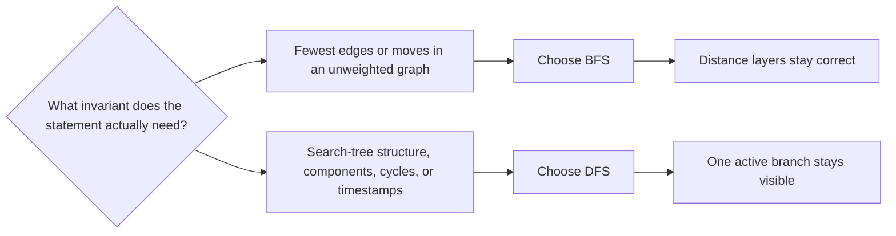

# BFS And DFS

Breadth-first search and depth-first search are the first graph traversals you should internalize so well that they become modeling reflexes.

They are not interchangeable.

They solve different kinds of graph questions because they preserve different invariants:

- BFS preserves **distance layers** in an unweighted graph.
- DFS preserves the structure of one **active search branch** together with entry/exit order.

Once that distinction becomes automatic, many graph problems stop looking like "some graph trick" and start looking like one of a few standard traversals plus problem-specific bookkeeping.

## At A Glance

- **Use when:** you need reachability, connected components, unweighted shortest paths, bipartite checks, cycle detection, traversal order, or tree/graph search structure
- **Core worldview:** traversal is not just "visit everything"; it is "visit everything while preserving the invariant the question actually cares about"
- **Main tools:** adjacency lists, `visited`, `dist`, `parent`, `color`, recursion stack or timestamps, queue for BFS, stack/recursion for DFS
- **Typical complexity:** `O(n + m)` with adjacency lists
- **Main trap:** using DFS when the statement really asks for shortest distance in number of edges, or using BFS when the statement actually needs DFS-style structural information

## Prerequisites

- [Graph Modeling](../graph-modeling/README.md)

Helpful neighboring topics:

- [Shortest Paths](../shortest-paths/README.md)
- [Topological Sort And SCC](../scc-toposort/README.md)
- [Trees](../trees/README.md)

## Problem Model And Notation

Let:

$$
G = (V, E)
$$

be a graph with:

- `n = |V|` vertices
- `m = |E|` edges

and suppose we start from a source vertex `s`.

For BFS, the key quantity is:

$$
\mathrm{dist}(s, v),
$$

the minimum number of edges on a path from `s` to `v` in an **unweighted** graph.

For DFS, the key quantities are structural:

- which vertices lie on the current active branch
- entry time `tin[v]`
- exit time `tout[v]`
- the parent relation in the DFS tree or forest

This is the first mental split:

- BFS is about **levels**
- DFS is about **search-tree structure**

## One Picture Before Code



The real choice is not "queue versus recursion."

It is "which traversal preserves the thing the statement will later ask me to prove?"

## Traversal Playground

<div class="visual-card" data-bfs-dfs-visualizer>
  <p class="visual-caption">
    Use the same graph and source for both traversals, then watch how the frontier changes.
    BFS expands by layers; DFS commits to one branch until it must backtrack.
  </p>
  <div class="visual-controls">
    <label>
      Source
      <select data-role="source">
        <option value="A">A</option>
        <option value="B">B</option>
        <option value="C">C</option>
        <option value="D">D</option>
        <option value="E">E</option>
        <option value="F">F</option>
        <option value="G">G</option>
        <option value="H">H</option>
      </select>
    </label>
    <button type="button" data-role="run-bfs">Run BFS</button>
    <button type="button" data-role="run-dfs">Run DFS</button>
    <button type="button" data-role="reset">Reset</button>
  </div>
  <div class="visual-grid">
    <div class="visual-panel">
      <div class="visual-surface" data-role="canvas"></div>
    </div>
    <div class="visual-panel">
      <h4>What to watch</h4>
      <div class="visual-stats">
        <div class="visual-stat">
          <strong>Current invariant</strong>
          <div data-role="invariant">
            Pick BFS when the statement cares about unweighted shortest distance; pick DFS when it cares about search structure.
          </div>
        </div>
        <div class="visual-stat">
          <strong>Frontier snapshot</strong>
          <code data-role="frontier">Queue / active branch: waiting to run</code>
        </div>
        <div class="visual-stat">
          <strong>Visit order</strong>
          <code data-role="order">-</code>
        </div>
        <div class="visual-stat">
          <strong>Distance or depth</strong>
          <code data-role="metric">-</code>
        </div>
        <div class="visual-stat">
          <strong>Traversal tree parent</strong>
          <code data-role="parent">-</code>
        </div>
      </div>
      <p class="visual-note" data-role="note">
        The adjacency order is alphabetical so the BFS and DFS orders are deterministic.
      </p>
    </div>
  </div>
</div>

## From Brute Force To The Right Idea

### Brute Force: Re-Search From Scratch

Suppose the statement says:

- is `t` reachable from `s`?
- what is the minimum number of moves?
- how many connected components are there?

The brute-force mindset is often:

- from each vertex, try many paths
- or repeatedly search again from scratch
- or keep vague "visited somehow" logic without a clean traversal contract

That tends to blur several different problems together.

### The First Shift: One Traversal Already Gives A Whole Tree

Both BFS and DFS do more than answer one yes/no query.

A traversal from `s` gives you a whole spanning structure over the reachable part of the graph:

- a **BFS tree** grouped by distance layers
- a **DFS tree/forest** grouped by recursive ancestry

That means many questions are not separate algorithms at all. They are:

- one traversal
- plus a small extra array or invariant

### The Second Shift: Choose The Invariant Before Choosing The Code

If the question is:

- "fewest edges"
- "minimum number of moves"
- "shortest route in an unweighted graph"

then the only traversal whose default invariant matches the problem is BFS.

If the question is:

- "what is the component structure?"
- "does a cycle exist?"
- "what is the traversal order?"
- "what intervals/subtrees/ancestor relations appear during search?"

then DFS is usually the natural fit.

### The Third Shift: Traversal Order Is The Proof

Most beginners treat BFS and DFS as two code snippets.

The better view is:

- the order in which vertices leave the queue proves BFS shortest-path correctness
- the active recursion stack and timestamps prove DFS structure claims

Once you see the proof as part of the traversal order, the implementation becomes much less magical.

## Core Invariants And Why They Work

## 1. Shared Traversal Invariant

Both BFS and DFS need the same first discipline:

```text
Every reachable vertex should be committed exactly once.
```

That is why every clean traversal has:

- a `visited` array
- or an equivalent "already discovered" state

Without that, cycles and multiple paths immediately break correctness or complexity.

## 2. BFS Layer Invariant

In BFS, vertices are discovered in nondecreasing distance from the source.

The strongest contest-useful version is:

```text
When a vertex v is first pushed into the queue,
its recorded distance dist[v] is already the shortest possible.
```

Why is this true?

- `s` is discovered with distance `0`
- when BFS pops a vertex at distance `d`, every outgoing edge reaches a vertex at distance at most `d + 1`
- because the queue is FIFO, all vertices at smaller distance are processed before any vertex at larger distance

So if `v` is first reached from `u`, then:

$$
\mathrm{dist}[v] = \mathrm{dist}[u] + 1
$$

is optimal.

This is why:

- unweighted shortest paths
- shortest path reconstruction
- minimum move count on grids

all collapse to plain BFS.

## 3. Why Mark-On-Push Matters In BFS

In contest BFS, the safest discipline is:

- mark `visited[v] = true` or assign `dist[v]` **when pushing**
- not when popping

Why?

Because first discovery is already the shortest-path certificate.

If you delay the mark until pop:

- the same vertex may be pushed many times
- parents may be overwritten accidentally
- queue size can blow up

This is not only slower. It often destroys the exact invariant you wanted.

## 4. DFS Active-Branch Invariant

DFS maintains a different structure:

```text
At any time, the recursion stack (or its iterative simulation)
is exactly one active search branch in the DFS forest.
```

That gives DFS powers BFS does not naturally expose:

- ancestor/descendant reasoning
- cycle detection through back edges or colors
- entry/exit times
- subtree intervals in DFS order
- topological-sort style finishing order

This is why many "structural graph" algorithms are DFS-first.

## 5. DFS Timestamp Invariant

If DFS records:

- `tin[v]` when entering `v`
- `tout[v]` when finishing `v`

then a key structural fact becomes available:

in tree-like DFS settings,

$$
u \text{ is an ancestor of } v
$$

if and only if:

$$
\mathrm{tin}[u] \le \mathrm{tin}[v]
\quad\text{and}\quad
\mathrm{tout}[v] \le \mathrm{tout}[u].
$$

You do not need that fact for basic traversal, but it explains why DFS is the right substrate for many later topics.

## 6. Components Come From Restarting Traversal

For either BFS or DFS:

- one run from one start vertex only covers the reachable region from that start

So for connected components in an undirected graph, the invariant is:

```text
Each fresh traversal from an unvisited vertex discovers exactly one new component.
```

That is why:

- count components
- label components
- collect one representative per component

all use the same outer loop:

```text
for each vertex:
    if unvisited:
        start traversal
```

## Variant Chooser

### Use BFS When

- the graph is unweighted
- edge cost is effectively `1`
- the question is about minimum number of edges / moves / steps
- you need shortest-path parents in an unweighted graph
- multi-source distance from a set of starts is natural

Canonical smells:

- "minimum number of moves"
- "shortest route"
- "fewest flights / transformations / steps"
- "spread from many sources"

### Use DFS When

- the answer depends on search-tree structure
- you need connected components, traversal order, or cycle logic
- ancestor/descendant or subtree reasoning matters
- the graph algorithm is really a DFS-based reduction in disguise

Canonical smells:

- "visit every reachable node"
- "is there a cycle?"
- "is the graph bipartite?"
- "process nodes after all descendants"

### Use Either BFS Or DFS When

- you only need reachability
- you only need connected components in an undirected graph
- you only need bipartite coloring and no distance information

In those cases, the better choice is mostly:

- BFS if layer distance is convenient
- DFS if recursion/order reasoning is convenient

### Do Not Use Plain DFS For Unweighted Shortest Path

This is the most common beginner mistake.

DFS may find *a* path. It does not preserve shortest distance in number of edges.

If every edge weight is `1`, the correct shortest-path traversal is BFS.

### Do Not Stop At Plain BFS If Edge Weights Are Not Uniform

If the graph has:

- weights `0` and `1`, think [Shortest Paths](../shortest-paths/README.md) and `0-1 BFS`
- arbitrary nonnegative weights, think Dijkstra
- negative edges, plain BFS is not the right family at all

## Worked Examples

### Example 1: Unweighted Shortest Path

This is the repo's canonical BFS note:

- [Message Route](../../../practice/ladders/graphs/bfs-dfs/messageroute.md)

Suppose the graph is unweighted and you need one shortest route from `1` to `n`.

Run BFS from `1` and store:

- `dist[v]`
- `parent[v]`

When `v` is first discovered, `dist[v]` is already optimal. So `parent[v]` at first discovery time becomes part of a shortest-path tree.

To reconstruct the route:

- start from `n`
- follow parents backward
- reverse the collected list

This is the cleanest possible BFS application because the traversal invariant and the problem invariant are identical.

### Example 2: Bipartite Check

Suppose an undirected graph must be colored with two colors so every edge joins opposite colors.

Run BFS or DFS and assign:

$$
\mathrm{color}[v] \in \{0, 1\}.
$$

Whenever you traverse an edge `(u, v)`:

- if `v` is uncolored, assign `1 - color[u]`
- if `v` is already colored and `color[v] = color[u]`, the graph is not bipartite

Why does this work?

Because every traversed edge forces opposite parity relative to the start of the component.

You do not need shortest distance here, so BFS and DFS are both valid. But BFS makes the "parity by layers" intuition especially visible.

### Example 3: Cycle Detection In An Undirected Graph

Suppose the graph is undirected and you need to know whether a cycle exists.

Run DFS (or BFS) and remember the parent edge used to enter each vertex.

When exploring an edge `(u, v)`:

- if `v` is unvisited, continue traversal
- if `v` is visited and `v != parent[u]`, a cycle exists

Why is the parent check necessary?

Because in an undirected graph every tree edge appears twice in adjacency lists. Seeing the parent again is normal; seeing any other visited neighbor means there is another path already connecting the two vertices.

### Example 4: Cycle Detection In A Directed Graph

Suppose you need to know whether a directed graph has a cycle.

Use DFS with a 3-color state:

- `0`: unvisited
- `1`: currently in recursion stack
- `2`: fully processed

When DFS explores an edge `(u, v)`:

- if `v` is `0`, continue DFS
- if `v` is `1`, you found a back edge into the active branch, so a cycle exists
- if `v` is `2`, that edge is harmless for cycle existence

This is a pure DFS-style invariant. BFS does not naturally expose the active-branch structure needed for this proof.

### Example 5: Multi-Source BFS

Suppose several starting cells all spread simultaneously.

Push all of them into the queue at distance `0` before the BFS starts.

Then the same BFS invariant gives:

$$
\mathrm{dist}[v] = \text{distance from } v \text{ to the nearest source}.
$$

This is not a new algorithm. It is still BFS, just with multiple layer-0 vertices.

### Example 6: Why DFS Fails For Unweighted Shortest Path

Consider:

```text
s -> a -> b -> t
s -> t
```

If DFS explores `a` before `t`, it may first discover a path of length `3`.

But the true shortest path has length `1`.

So "first path found" means nothing for shortest paths under DFS.

That counterexample is worth remembering because it prevents many wrong first instincts.

## Algorithms And Pseudocode

### BFS

```text
bfs(source):
    set dist[*] = -1
    dist[source] = 0
    parent[source] = -1
    queue q
    q.push(source)

    while q not empty:
        u = q.front()
        q.pop()
        for v in adj[u]:
            if dist[v] != -1:
                continue
            dist[v] = dist[u] + 1
            parent[v] = u
            q.push(v)
```

Default interpretation:

- `dist[v] == -1` means undiscovered
- first push fixes both discovery and shortest distance

### Multi-Source BFS

```text
multi_source_bfs(all_sources):
    set dist[*] = -1
    queue q

    for s in all_sources:
        dist[s] = 0
        q.push(s)

    while q not empty:
        u = q.front()
        q.pop()
        for v in adj[u]:
            if dist[v] != -1:
                continue
            dist[v] = dist[u] + 1
            q.push(v)
```

### DFS (Recursive Shape)

```text
dfs(u, p):
    visited[u] = true
    parent[u] = p
    tin[u] = timer++

    for v in adj[u]:
        if v == p in an undirected graph:
            continue
        if not visited[v]:
            dfs(v, u)

    tout[u] = timer++
```

### DFS Cycle Detection In An Undirected Graph

```text
dfs_cycle(u, p):
    visited[u] = true
    for v in adj[u]:
        if v == p:
            continue
        if visited[v]:
            found_cycle = true
        else:
            dfs_cycle(v, u)
```

### DFS (3-Color Cycle Detection In Directed Graph)

```text
dfs(u):
    color[u] = 1
    for v in adj[u]:
        if color[v] == 0:
            dfs(v)
        else if color[v] == 1:
            found_cycle = true
    color[u] = 2
```

## Implementation Notes

- Prefer adjacency lists for contest graphs. With adjacency matrices, traversal cost degrades toward `O(n^2)`.
- In BFS, mark on push, not pop.
- In undirected DFS, parent-check logic differs from directed cycle logic. Do not mix them.
- Recursive DFS is concise, but iterative DFS is safer when the graph may degenerate into a chain of length `2e5` or more.
- If the graph may be disconnected, wrap traversal inside an outer loop over all vertices.
- For path reconstruction, store `parent` only when the vertex is first committed.
- For grids, BFS/DFS are the same ideas after graph modeling; neighbors are just generated implicitly instead of stored explicitly.

## Practice Archetypes

You should be able to recognize these immediately:

- one shortest route in an unweighted graph
- minimum number of moves on a grid
- connected components
- bipartite check / two-coloring
- directed or undirected cycle detection
- traversal order / finish order as preparation for a later graph algorithm

Repo anchors:

- [Message Route](../../../practice/ladders/graphs/bfs-dfs/messageroute.md)
- [Counting Rooms](../../../practice/ladders/graphs/graph-modeling/countingrooms.md)
- [Building Roads](../../../practice/ladders/graphs/graph-modeling/buildingroads.md)

Starter templates:

- [bfs.cpp](https://github.com/mtuann/competitive-programming-cpp/blob/main/templates/graphs/bfs.cpp)
- [dfs-iterative.cpp](https://github.com/mtuann/competitive-programming-cpp/blob/main/templates/graphs/dfs-iterative.cpp)

Notebook refresher:

- [Graph cheatsheet](../../../notebook/graph-cheatsheet.md)

## References And Repo Anchors

Primary / course style:

- [Cornell CS 2110: Graph Traversal](https://www.cs.cornell.edu/courses/cs2110/2019sp/L18-GraphTraversal/L18-GraphTraversal.pdf)
- [Stanford CS106B: Graph Algorithms](https://web.stanford.edu/class/archive/cs/cs106b/cs106b.1242/lectures/26-graphs/)

Reference:

- [CP-Algorithms: Breadth First Search](https://cp-algorithms.com/graph/breadth-first-search.html)
- [CP-Algorithms: Depth First Search](https://cp-algorithms.com/graph/depth-first-search.html)
- [USACO Guide: Graph Traversal](https://usaco.guide/silver/graph-traversal?lang=cpp)

Practice / repo anchors:

- [Graphs ladder overview](../../../practice/ladders/graphs/README.md)
- [BFS / DFS ladder](../../../practice/ladders/graphs/bfs-dfs/README.md)
- [Message Route](../../../practice/ladders/graphs/bfs-dfs/messageroute.md)

## Related Topics

- [Graph Modeling](../graph-modeling/README.md)
- [Shortest Paths](../shortest-paths/README.md)
- [Topological Sort And SCC](../scc-toposort/README.md)
- [Trees](../trees/README.md)
